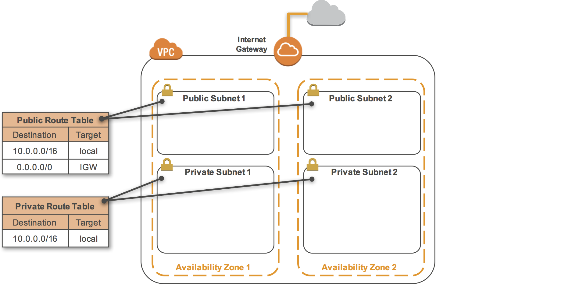

## AWS-VPC-with-CloudFormation
### AWS CloudFormation template that creates an Amazon VPC

Here are the resources of VPC that have been created by CloudFormation:

	• An Amazon VPC
  	• 2 Private Subnets
  	• 2 Public Subnets
	• An Internet Gateway
  	• 1 Private Route Table
  	• 1 Public Route Table

 
